# Apigee OIDC Integration with Okta

This repository contains the configuration and resources to integrate **Apigee** with **Okta** as an external Identity Provider (IdP) using the OpenID Connect (OIDC) protocol. 

In this architecture, Apigee acts as an OAuth 2.0 Authorization Server and API Gateway. It mediates the authentication flow (Authorization Code Grant) with Okta, stores the issued tokens, and validates incoming API requests locally without forwarding every request to Okta. Furthermore, to enhance security and prevent authorization code interception attacks, **PKCE (Proof Key for Code Exchange)** is strictly enforced throughout the authentication flow.

---

## Architecture

The following diagram illustrates the interaction between the Client, Apigee, and Okta during the OAuth 2.0 Authorization Code Flow and subsequent API calls.
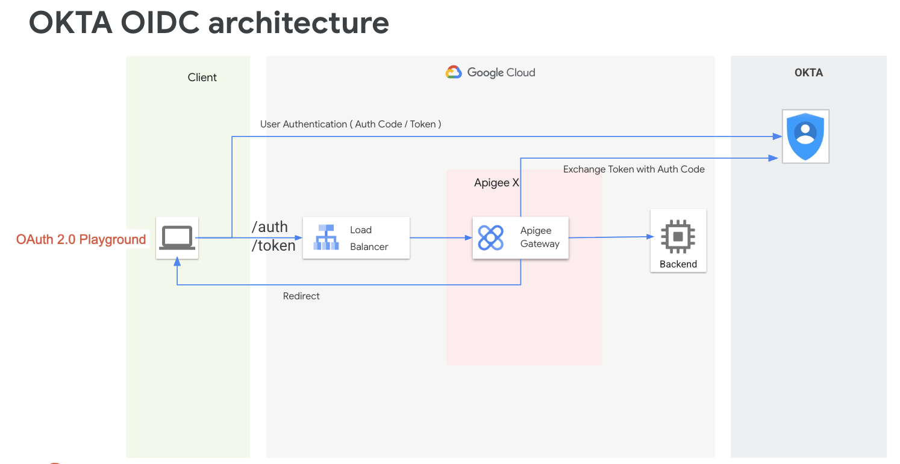


### Sequence Flow

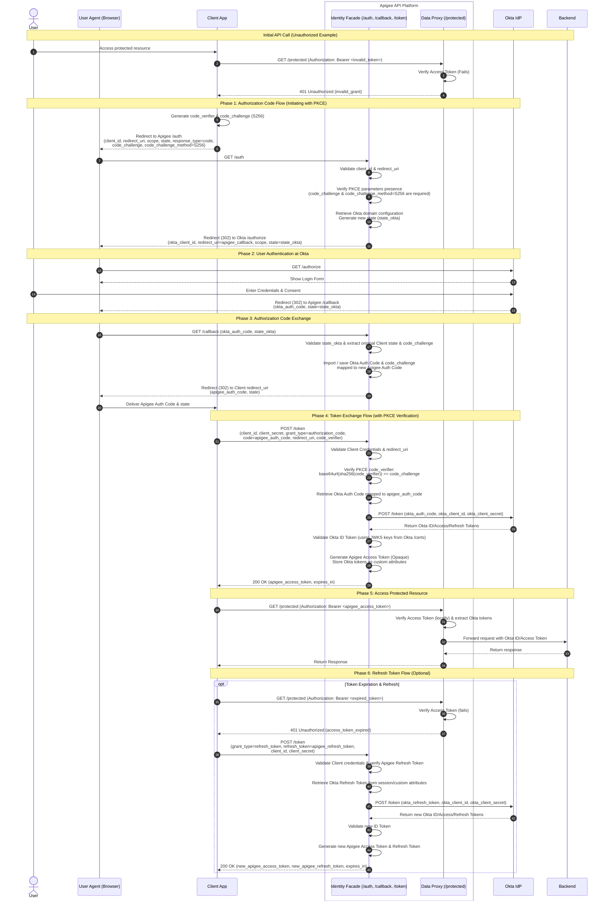

### Key Highlights
1. **Opaque Tokens**: The client application only receives an opaque access token minted by Apigee. The backend Okta tokens (Access/ID Token) are stored securely as custom attributes within Apigee.
2. **Local Token Verification**: Subsequent API calls are validated inside Apigee via the `VerifyAccessToken` policy, ensuring minimal latency and high performance.
3. **Decoupled Client Management**: The API client registers and authenticates against Apigee, while user identity remains centralized in Okta.
4. **Mandatory PKCE Enforcement**: The architecture strictly enforces PKCE (Proof Key for Code Exchange) using the `S256` challenge method. Authorization requests without the required PKCE parameters (`code_challenge` and `code_challenge_method`) are rejected at the Apigee gateway level.

---

## Okta Setup

Follow these steps to configure your Okta Developer Account to work with Apigee.

### 1. Register a Web Application in Okta
1. Sign in to your [Okta Developer Console](https://developer.okta.com/).
2. In the left-hand navigation menu, go to **Applications** > **Applications**.
3. Click **Create App Integration**.
4. Select **OIDC - OpenID Connect** as the Sign-in method, and **Web Application** as the Application type. Click **Next**.
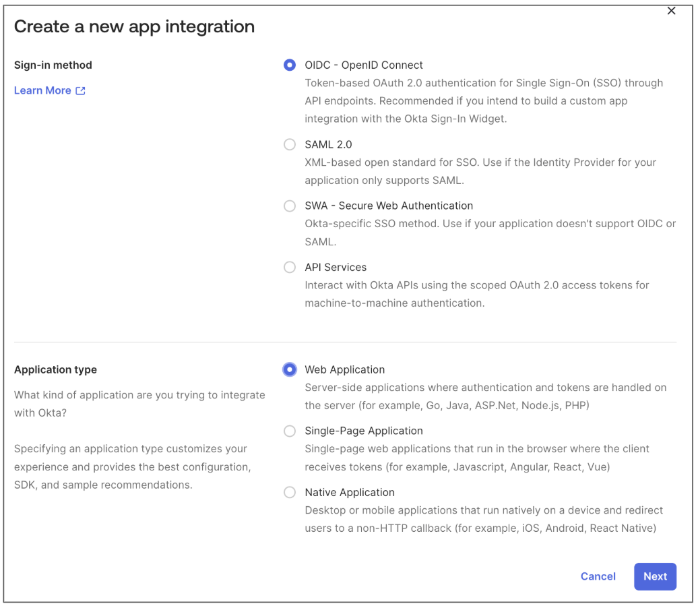
5. Configure the application:
   - **App integration name**: `Apigee App`
   - **Grant type**: Authorization Code
   - **Sign-in redirect URIs**: 
     ```text
     https://YOUR_APIGEE_HOST/v1/oidc/pkce/callback
     ```
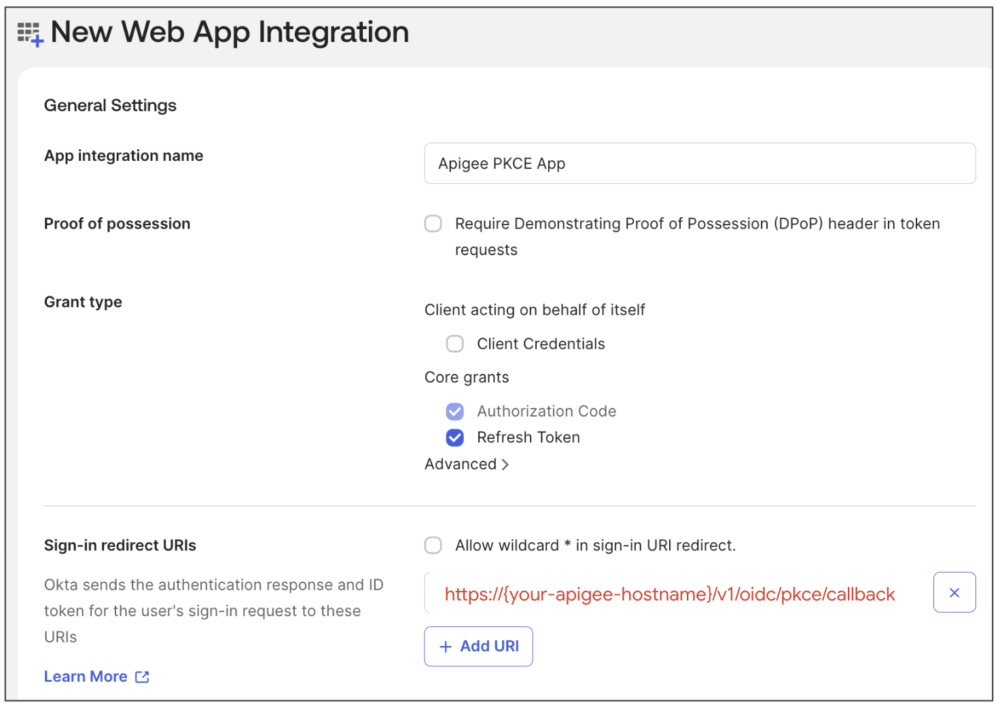   
   - **Controlled access**: Select **Allow everyone in your organization to access** (or configure groups accordingly).
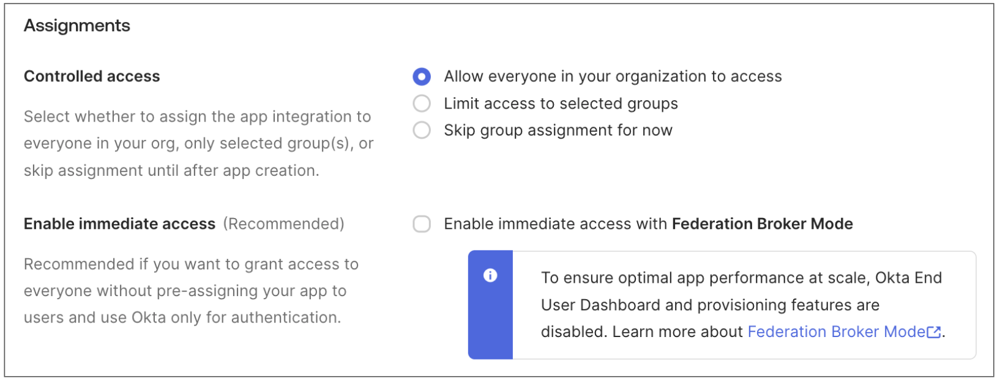
6. Click **Save**.

> [!IMPORTANT]
> **Configure Okta Access Policy (Sign-on Policy)**
> If the users testing the integration encounter the error:
> `idx error code: no matching policy - You are not allowed to access this app. To request access, contact an admin.`
> It means they do not match any rules in the application's Access Policy. 
> To resolve or prevent this, configure the Access Policy under the **Sign On** tab of the application in the Okta Admin Console:
> 1. Go to **Applications** > **Applications** and select your application.
> 2. Click the **Sign On** tab.
> 3. Under **User Access**, verify the assigned **Access Policy** and its rules.
> 4. Ensure there is a rule that matches your test user or group and permits access. For detailed steps, see the [Okta Support Article](https://support.okta.com/help/s/article/error-idx-error-code-no-matching-policy-you-are-not-allowed-to-access-this-app-to-request-access-contact-an-admin?language=en_US).


### 2. Capture Client Credentials & Okta Domain
On the Okta App configuration page, copy and save the following credentials:
- **Client ID**
- **Client Secret**
- **Okta Domain** (e.g., `integrator-XXXXXX.okta.com`)
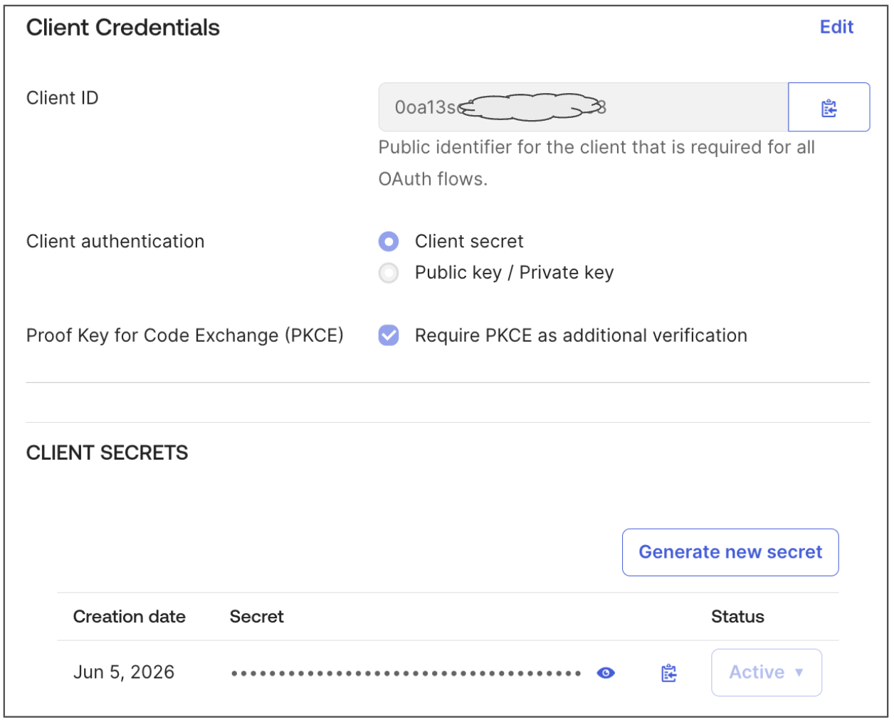

### 3. Create a Test User in Okta
1. Navigate to **Directory** > **People**.
2. Click **Add Person**.
3. Fill out the user details (a real email address is not required if the password is set by the admin).
4. Set the password option to **Set by Admin** and configure a password.
5. Click **Save**.

### 4. Assign the Application to the Test User
If you did not select "Allow everyone in your organization to access" during the application setup (or if your Okta organization requires manual assignment):
1. Navigate to **Applications** > **Applications**.
2. Click on the application you created (`Apigee PKCE App`).
3. Select the **Assignments** tab.
4. Click the **Assign** dropdown and choose **Assign to People**.
5. Find your test user, click **Assign**, and click **Save and Go Back**.
6. Click **Done**.

---

## oidc proxy Setup

### 1. Configure Okta Domain
Before deploying the proxy, you must check the Discovery document:
1. Open `https://YOUR_OKTA_DOMAIN/oauth2/default/.well-known/openid-configuration` in your browser to check the configuration details.
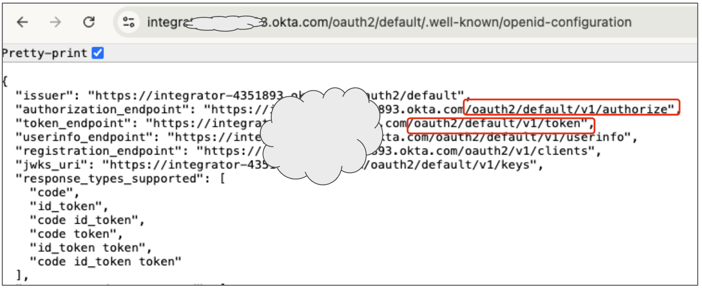
2. Open the okta.properties file located at `./apiproxy/resources/properties/okta.properties`.
3. Replace `okta_domain`, `okta_authorize_uri`, `okta_token_uri`, `okta_jwks_uri`, `okta_idp_issuer` with the values verified from the Discovery document:
   ```properties
   okta_domain=integrator-XXXXXX.okta.com
   okta_authorize_uri=/oauth2/default/v1/authorize
   okta_token_uri=/oauth2/default/v1/token
   okta_jwks_uri=/oauth2/default/v1/keys
   okta_idp_issuer=https://YOUR_OKTA_DOMAIN/oauth2/default

   apigee_host=YOUR_APIGEE_HOST
   apigee_redirect_uri=/v1/oidc/pkce/callback  
   ```
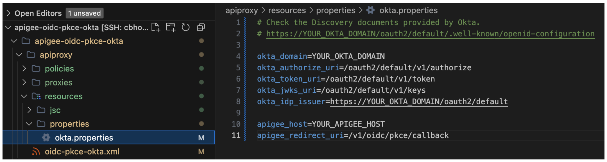

### 2. Deploy the Proxy & Configure Entities
Configure your Apigee environment variables and run the deployment script to deploy the API proxy, and automatically set up the API product and developer app.

1. Open [env.sh](./env.sh) and configure your Apigee Organization and Environment:
   ```bash
   export APIGEE_ORG="your-apigee-org"
   export APIGEE_ENV="your-apigee-env"
   ```
   Then, run the following command to apply the changes:
   ```bash
   source ./env.sh
   ```

2. Run the deployment script:
   ```bash
   ./deploy-oidc-pkce-okta.sh
   ```

3. Note down the **Client ID** (Consumer Key) and **Client Secret** (Consumer Secret) returned at the end of the script:
   ```text
   ============================================================
   Deployment and Setup Completed!
   API Proxy: oidc-pkce-okta
   Developer App: oidc-pkce-okta-app
   Client ID (Consumer Key): XXXXXXXXXXXXXXXXXXXXXXXXXXXXXXXX
   Client Secret (Consumer Secret): XXXXXXXXXXXXXXXXXXXXXXXXXXXXXXXX
   ============================================================
   ```

4. Configure the Okta Client ID and Client Secret in the Apigee Key Value Map (KVM) using the `/kvm` endpoint. The `apikey` header value must be the **Apigee Client ID** (Consumer Key) obtained in Step 3.

   **Update Okta Client ID in KVM:**
   ```bash
   curl --location 'https://{YOUR_APIGEE_HOSTNAME}/v1/oidc-pkce/kvm' \
   --header 'apikey: {YOUR_APIGEE_CLIENT_ID}' \
   --header 'Content-Type: application/json' \
   --data '{
     "kvm-key":"okta.pkce.app.id",
     "kvm-val":"YOUR_OKTA_CLIENT_ID"
   }'
   ```

   **Update Okta Client Secret in KVM:**
   ```bash
   curl --location 'https://{YOUR_APIGEE_HOSTNAME}/v1/oidc-pkce/kvm' \
   --header 'apikey: {YOUR_APIGEE_CLIENT_ID}' \
   --header 'Content-Type: application/json' \
   --data '{
     "kvm-key":"okta.pkce.app.secret",
     "kvm-val":"YOUR_OKTA_CLIENT_SECRET"
   }'
   ```

---

## Test

To verify the integration, use **oauth.tools**.

### 1. Configure the oauth.tools Workspace
1. Open [oauth.tools](https://oauth.tools/).
2. In the Workspace settings, configure the following:
   - **Endpoints** tab:
     - **Authorization Endpoint**: `https://{your-apigee-hostname}/v1/oidc/pkce/auth`
     - **Token Endpoint**: `https://{your-apigee-hostname}/v1/oidc/pkce/token`
   - **Clients** tab:
     - Add a client using the **Client ID** and **Client Secret** of your Apigee App (Consumer Key and Consumer Secret).
   - **Scopes/Claims** tab:
     - Add the scopes: `openid profile email offline_access`.
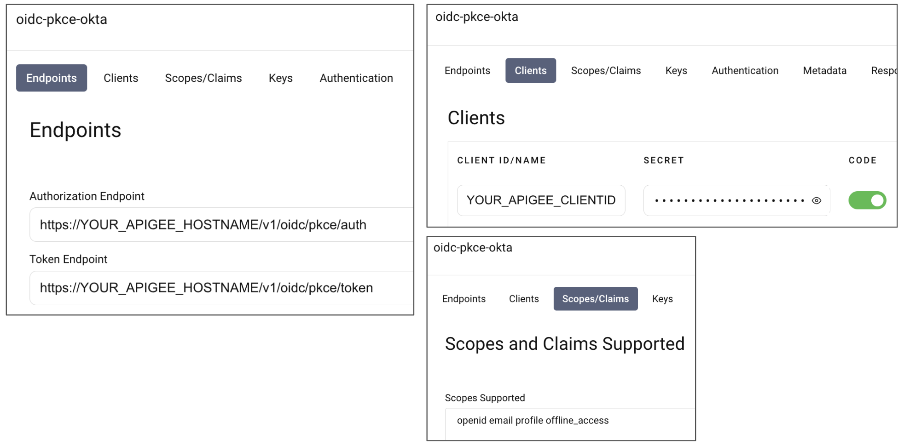


### 2. Access Token Flow
1. On oauth.tools, click **Start Flow** and select **Code Flow**.
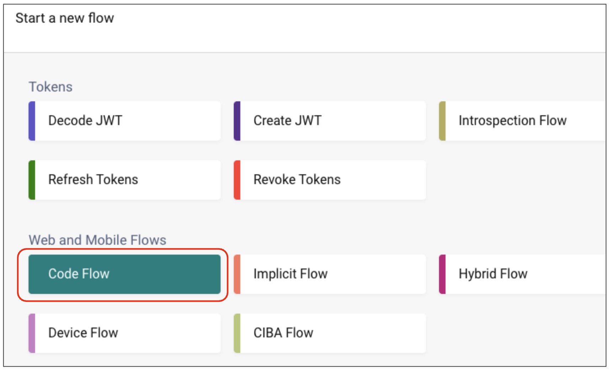

2. Select the client, scopes, and endpoints you registered in Step 1.

3. Under the **PKCE** option, ensure that **Use PKCE** is checked and the challenge method is set to **S256**. (Since PKCE is mandatory, the request will fail if PKCE parameters are omitted).
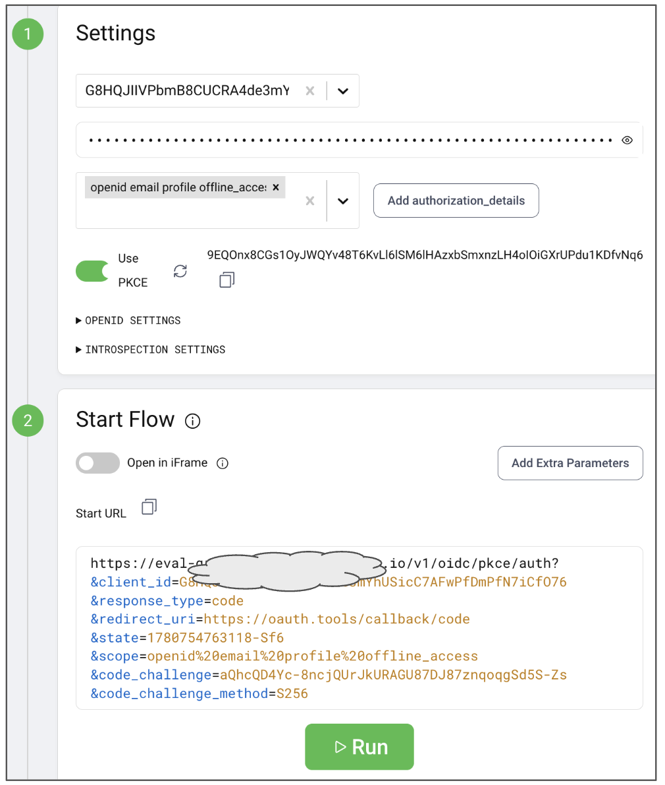

4. Review the request details and click **Run**.

4. The Okta login screen will pop up in a new window. Log in using the test user credentials created in Okta.

5. Upon successful login, the **authorization code** will be returned.
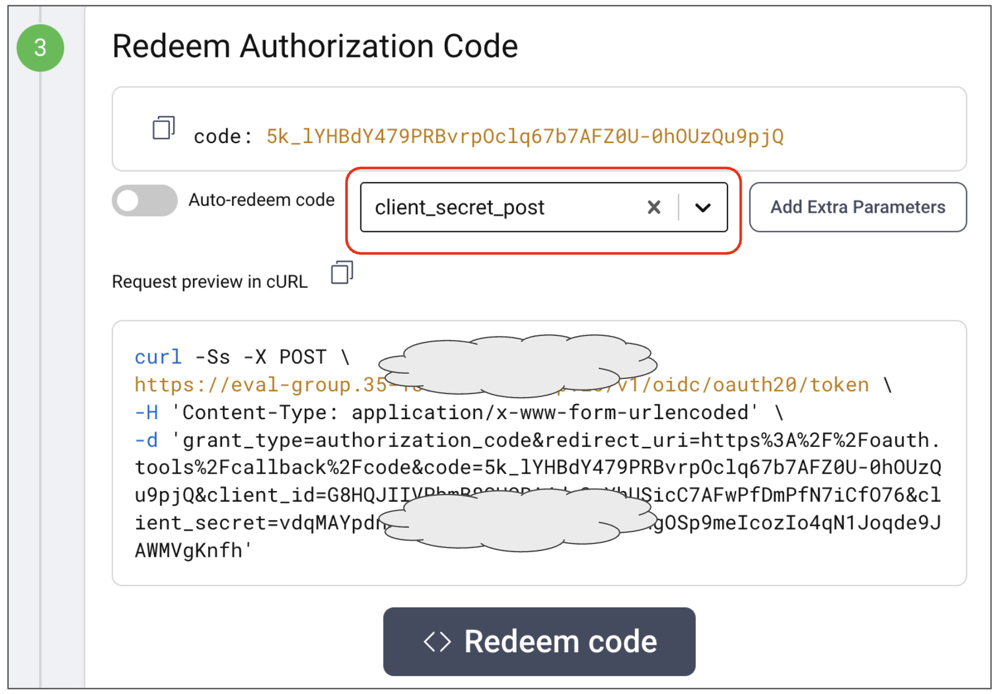

6. Select `client_secret_post` as the authentication method.
7. Click **Redeem Code** and verify that the access token (opaque token generated by Apigee) is successfully returned.
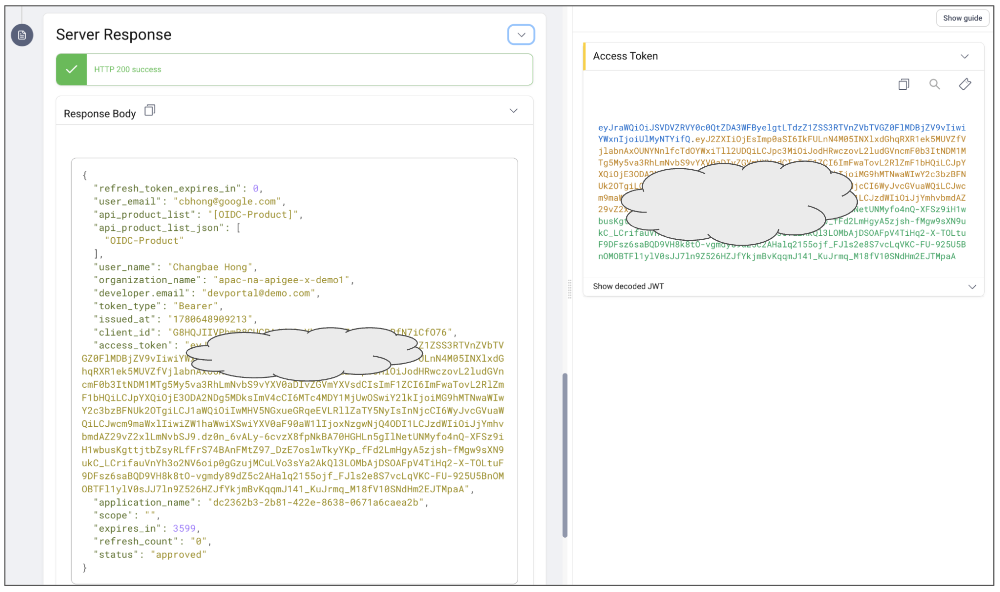

### 3. Refresh Token Flow
1. On oauth.tools, click **Start Flow** and select **Refresh Tokens**.
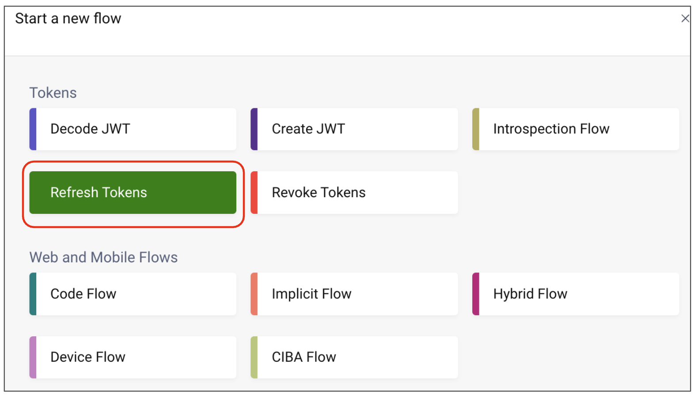

2. In the configuration screen, select your Client and scopes, choose `client_secret_post` (POST) as the authentication method, and select the **Refresh Token** received in the previous step.
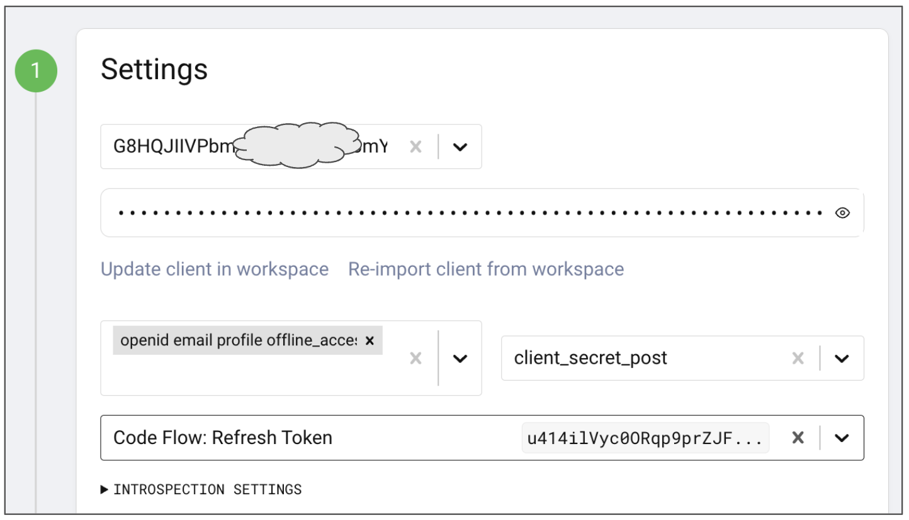

3. Review the generated request details and click **Refresh Token**.
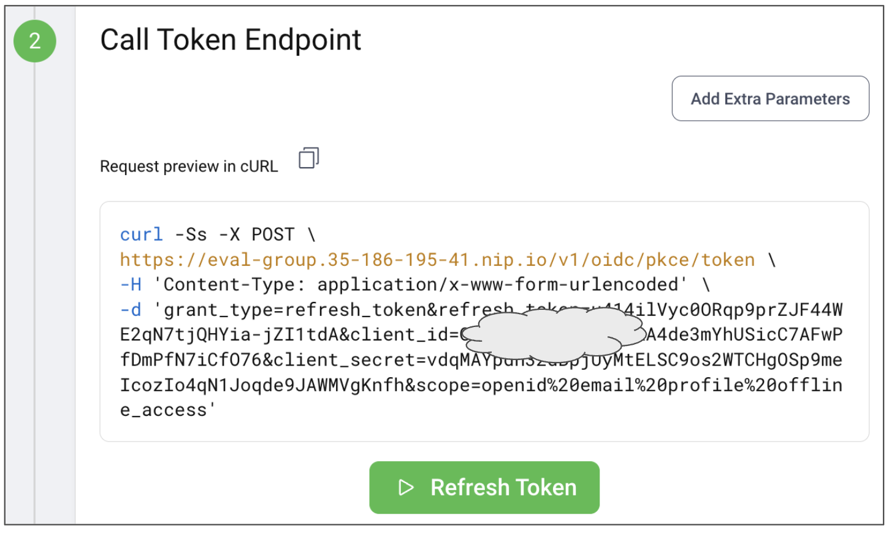

4. Verify that a new Access Token and Refresh Token are successfully returned. Note that depending on your Okta configuration, the Refresh Token will either be **rotating** (issuing a new refresh token upon use) or **persistent** (retaining the same refresh token).
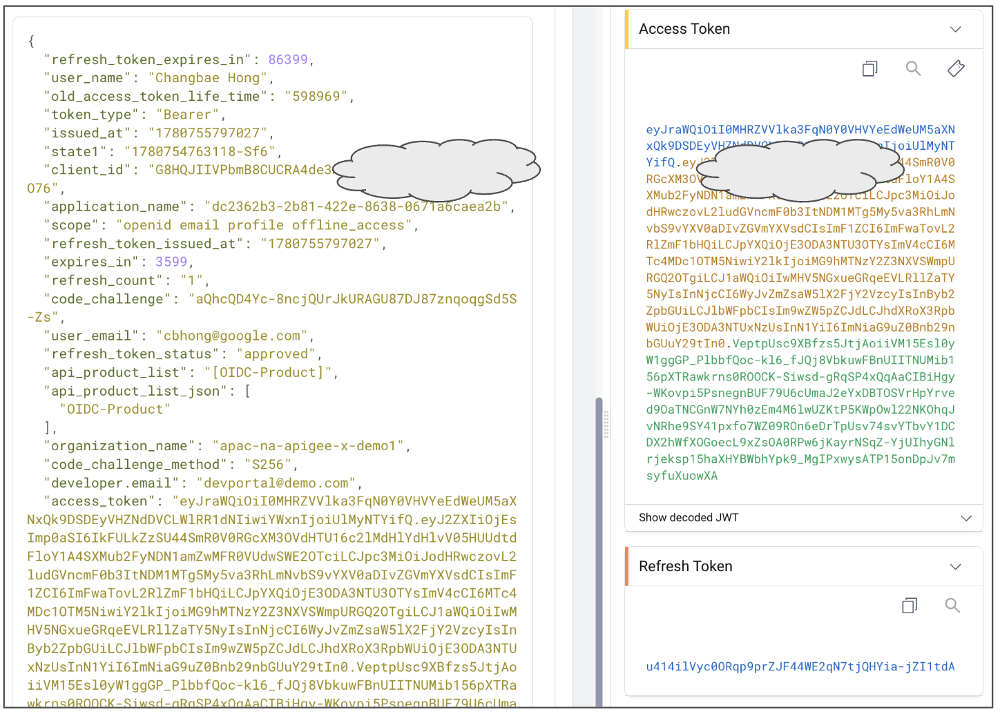


### 4. Access Protected API
To verify the token, send a request to the protected endpoint using the retrieved access token:
```bash
curl -H "Authorization: Bearer {YOUR_ACCESS_TOKEN}" https://{your-apigee-hostname}/v1/oidc/pkce/protected
```
Verify that the request returns `200 OK` along with the expected payload.

---

## Clean Up / Undeploy

Once testing is complete, you can remove all created Apigee resources (Developer App, Developer, API Product, and API Proxy) by running the cleanup script:

```bash
./undeploy-all.sh
```

